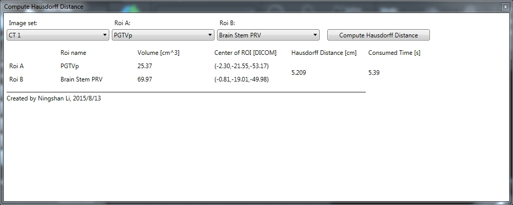

# Calculate [Hausdorff Distance](https://en.wikipedia.org/wiki/Hausdorff_distance)

主程序为[HausdorffDistance.py](HausdorffDistance.py)文件，在*Raystation*中运行，已封装了[Distance](Distance.py)模块和[ROICoordinate](ROICoordinate.py)模块中的自定义函数

[DistanceMulti](DistanceMulti.py)模块为多线程运行脚本，所需执行时间比单线程要少，在主程序中导入不同的模块即可切换

脚本测试见[Hausdorff Distance脚本测试.pdf](Hausdorff%20Distance脚本测试.pdf)

运行[HausdorffGUI.py](HausdorffGUI.py)可启动[GUI](Hausdorff.xaml)，GUI测试通过，效果图如下

相关文章发表于[中华肿瘤杂志, 2017,39(12) : 942-945. DOI: 10.3760/cma.j.issn.0253-3766.2017.12.012](http://rs.yiigle.com/resource_static.jspx?contentId=1013835)